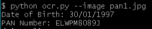

# ocr_on_pan_card
Apply Optical Character Recognition to read date of birth and pan number from images of pancards.

List of libraries to be installed: 
openCV  
Tesseract-OCR  
pytesseract  
Pillow  
ftfy  

